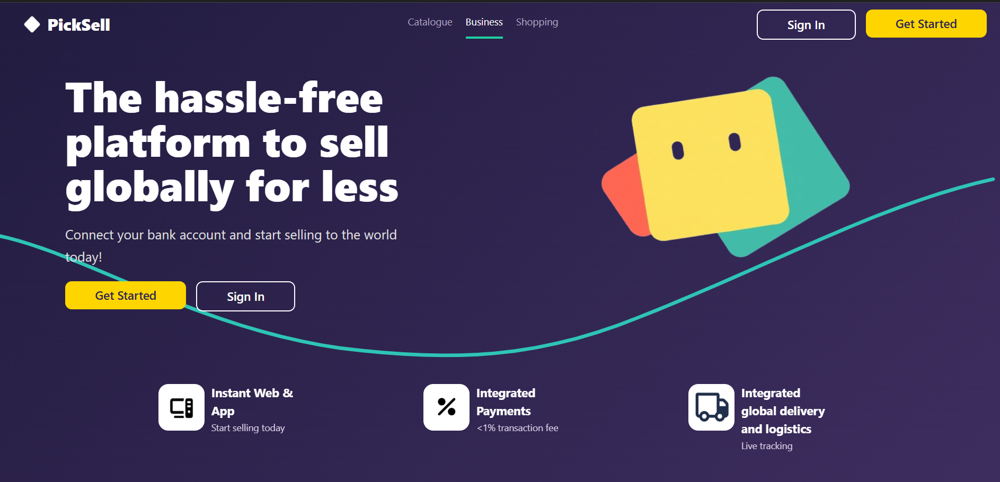
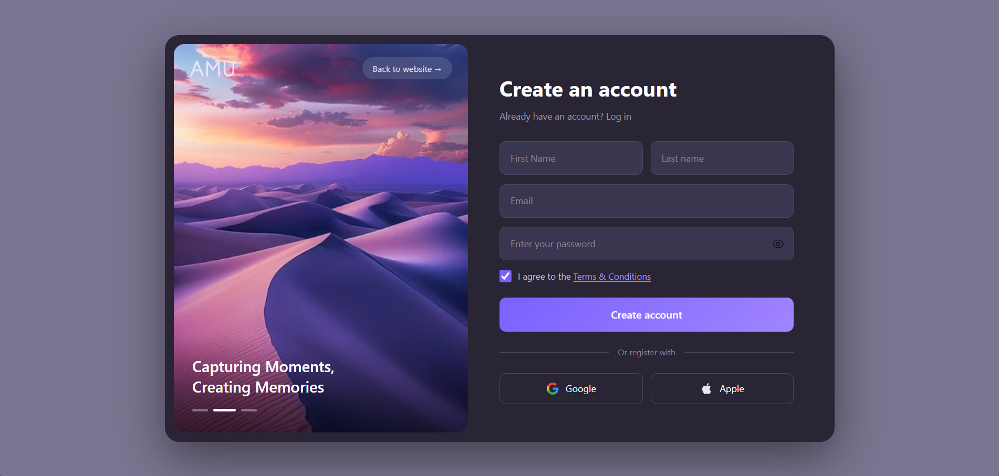
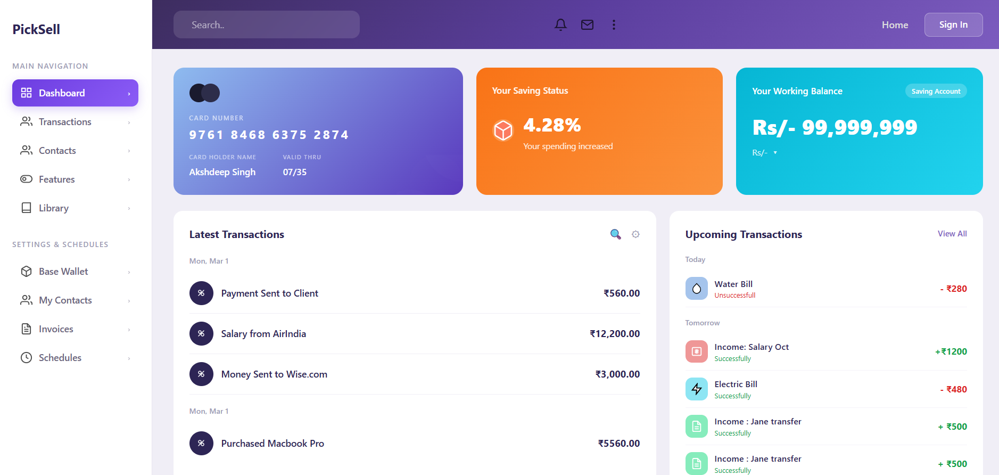

# PickSell 💸

> A modern, hassle-free platform to sell globally for less built with React, Vite, and Tailwind CSS.

[](https://insider-task-1.vercel.app)
[](https://react.dev)
[](https://vitejs.dev)
[](https://tailwindcss.com)

---

## 📌 Overview

**PickSell** is a full-featured financial and e-commerce platform UI that lets users connect their bank accounts and start selling to the world. The app includes a polished landing page, an intuitive dashboard for managing transactions and balances, and a sleek account creation flow.

---

## 🖥️ Screenshots

---

---

---

### 🏠 Landing Page


The home page highlights PickSell's core value propositions instant web & app setup, integrated payments with <1% transaction fees, and global delivery & logistics with live tracking.

---

### 📊 Dashboard

### 🔐 Create Account


A clean, split-panel sign-up page with a scenic background image, support for Google and Apple OAuth, and a minimal registration form.

---


The dashboard gives users a real-time overview of:

* Their saved card details and card number
* Current savings status and spending trends
* Working balance (savings account)
* Latest and upcoming transactions

---

## ✨ Features

* 💳 **Card Overview**: Displays card number, holder name, and validity
* 📈 **Savings Status**: Visual indicator for spending trends and saving rate
* 💰 **Working Balance**: Real-time balance display for savings accounts
* 🔄 **Latest Transactions**: Grouped transaction history with amounts
* 📅 **Upcoming Transactions**: Scheduled bills and income with status badges
* 🔐 **Authentication UI**: Sign up and sign in with email or OAuth (Google/Apple)
* 🌍 **Landing Page**: Marketing page with feature highlights and CTAs

---

## 🛠️ Tech Stack

| Technology                              | Purpose                 |
| --------------------------------------- | ----------------------- |
| [React](https://react.dev)              | UI component library    |
| [Vite](https://vitejs.dev)              | Build tool & dev server |
| [Tailwind CSS](https://tailwindcss.com) | Utility-first styling   |
| [ESLint](https://eslint.org)            | Code linting            |
| [Vercel](https://vercel.com)            | Deployment              |

---

## 🚀 Getting Started

### Prerequisites

* Node.js `v18+`
* npm or yarn

---

## 📁 Project Structure

```
Insider-Task_1/
├── public/
├── src/
│   ├── assets/        # images used in README
│   ├── components/
│   ├── pages/
│   └── main.jsx
├── index.html
├── tailwind.config.js
├── vite.config.js
└── package.json
```

---

## 🌐 Live Demo

👉 https://insider-task-1.vercel.app

---

### Installation

```bash
# 1. Clone the repository
git clone https://github.com/its-akshdeep06/Insider-Task_1.git

# 2. Navigate into the project
cd Insider-Task_1

# 3. Install dependencies
npm install

# 4. Start the development server
npm run dev
```

The app will be running at `http://localhost:5173`.

---

### Build for Production

```bash
npm run build
```

---

## 👤 Author

**Akshdeep Singh**

* GitHub: https://github.com/its-akshdeep06

---
